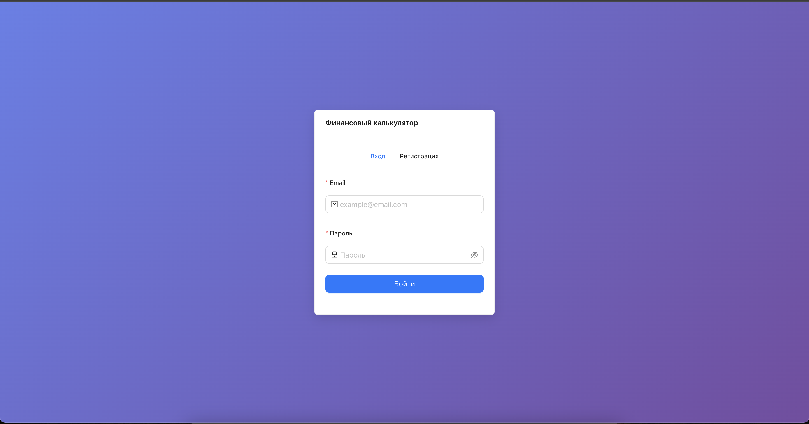
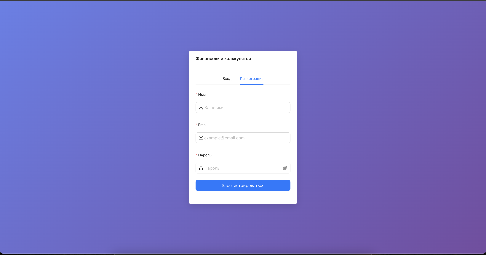
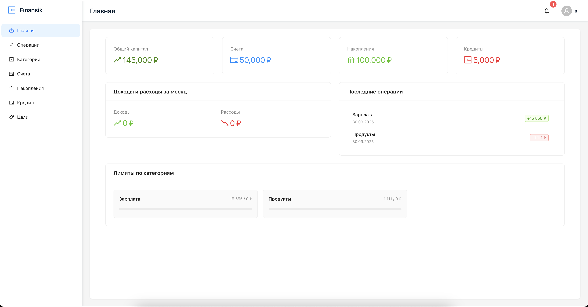
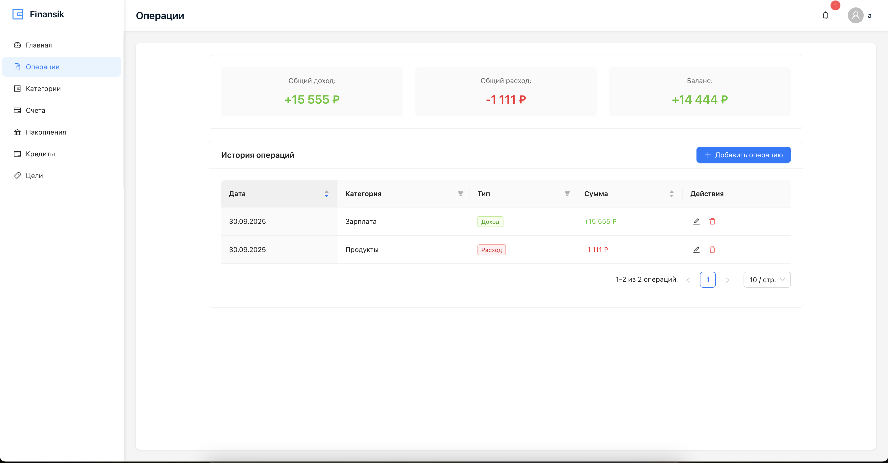
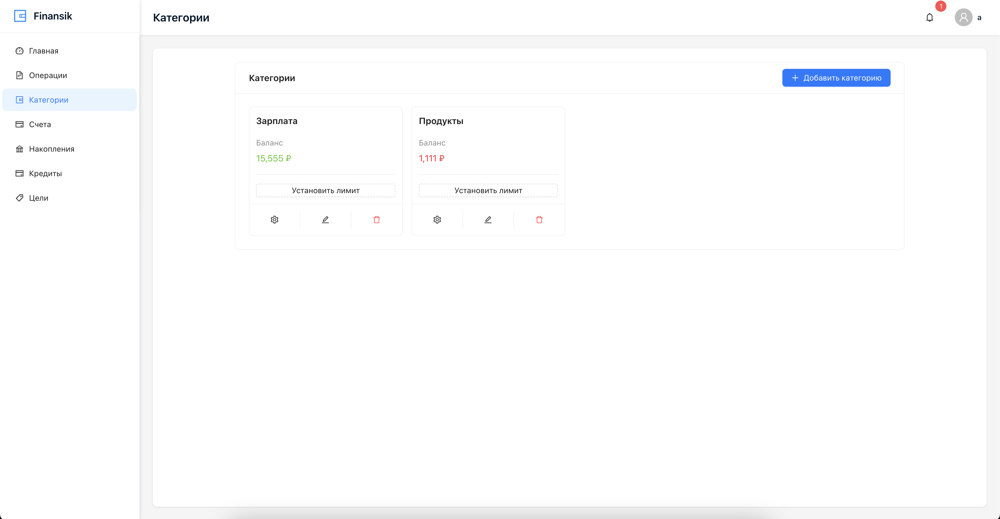
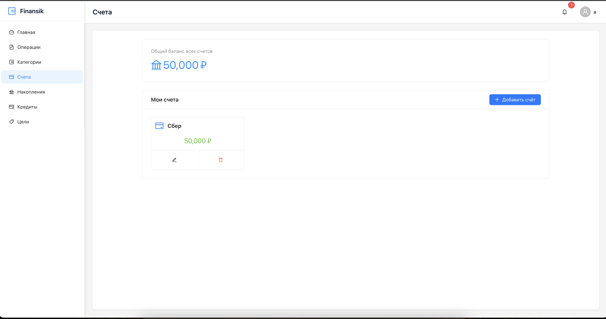
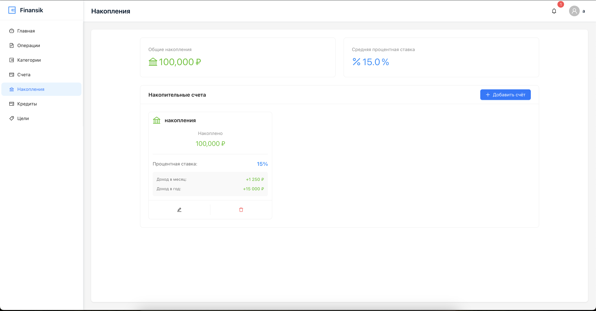
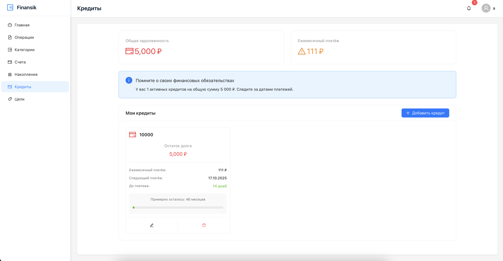
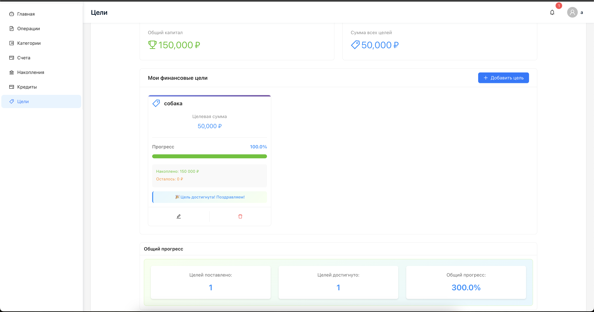
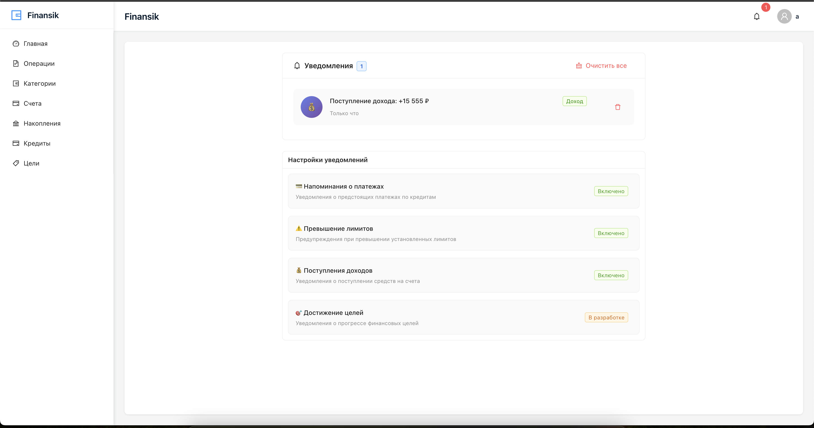

# Finansik

> Веб-приложение для управления личными финансами на React + TypeScript + Ant Design.

---

## 📸 UI Design

### Авторизация



### Регистрация



### Главная (Дашборд)



### Операции



### Категории



### Счета



### Накопления



### Кредиты



### Цели



### Уведомления



---

## 🚀 Быстрый старт

1. Установите зависимости:

```sh
 npm install
```

2. Запустите проект:

```sh
  npm run dev
```

## Технологии

- React + TypeScript
- AntDesign (UI)
- RTK + RTK Query
- React Router v6
- CSS Modules
- Vite (сборка)
- JWT (Авторизация)

## Структура проекта

> src/
>
> - components/ # UI-компоненты (Auth, Layout).
> - pages/ # Страницы приложения
> - store/ # Redux store и слайсы
> - types/ # Типы данных
> - data/ # Моковые данные
> - hooks/ # Кастомные хуки
> - utils/ # Утилиты

## Функционал

> - Авторизация и регистрация (JWT)
> - Дашборд: общий капитал, доходы/расходы, лимиты
> - Операции: учёт доходов и расходов
> - Категории: управление и лимиты
> - Счета: банковские карты, наличные
> - Накопления: процентные счета
> - Кредиты: займы, платежи, напоминания
> - Цели: финансовые цели, прогресс
> - Уведомления: лимиты, платежи, поступления, достижения

## Ключевые файлы

> - src/data/mockData.ts — моки
> - src/store/appSlice.ts — бизнес-логика
> - src/store/authSlice.ts — авторизация
> - src/hooks/redux.ts — типизированные хуки
> - src/utils/notifications.ts — уведомления
> - src/types/index.ts — типы данных
> - src/components/Auth/Auth.tsx — UI авторизации
> - src/components/Layout/AppLayout.tsx — основной лейаут

## Дальнейшее развитие

- Интеграция с реальным API
- Генерация отчётов
- Графики и аналитика
